# API-Master: Comprehensive Codebase Analysis

> **Note**: This document contains Mermaid diagrams. For best viewing experience, use:
> - GitHub (native Mermaid support)
> - Visual Studio Code with Mermaid Preview extension
> - Typora, Obsidian, or other Mermaid-compatible editors
> - Online viewers like [Mermaid Live Editor](https://mermaid.live/)

## Executive Summary

API-Master is a modern, full-stack web application designed for comprehensive API key management. Built with Next.js 15, React 19, TypeScript, and Supabase, it provides a production-ready solution for organizations and developers who need to manage, monitor, and secure their API keys effectively.

**Key Metrics:**
- **Codebase Size**: ~15,000+ lines of code
- **Technology Stack**: 8 core technologies
- **Architecture**: 3-tier client-server-database
- **Features**: 20+ distinct features
- **Security**: Row-Level Security (RLS) implementation

---

## Table of Contents

1. [Software Architecture Analysis](#software-architecture-analysis)
2. [Software Developer Analysis](#software-developer-analysis)
3. [Product Manager Analysis](#product-manager-analysis)
4. [Technical Deep Dive](#technical-deep-dive)
5. [Security Assessment](#security-assessment)
6. [Performance Analysis](#performance-analysis)
7. [Scalability Considerations](#scalability-considerations)
8. [Recommendations](#recommendations)

---

## Software Architecture Analysis

### System Architecture Overview

**Architecture Diagram:**
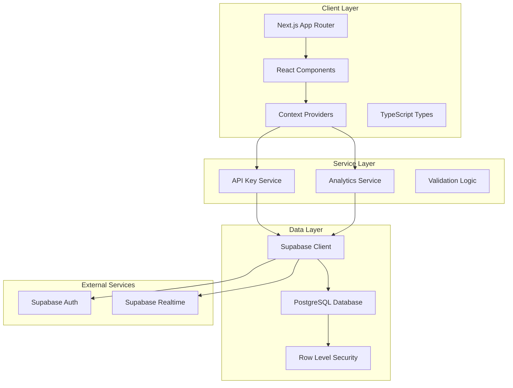

<details>
<summary>📋 Text Description of Architecture (Click to expand)</summary>

**Client Layer:**
- Next.js App Router → React Components → Context Providers
- TypeScript Types support all layers

**Service Layer:**
- API Key Service (CRUD operations)
- Analytics Service (metrics calculation)
- Validation Logic (business rules)

**Data Layer:**
- Supabase Client → PostgreSQL Database
- Row Level Security policies
- Integration with Supabase Auth and Realtime

</details>

### Architectural Patterns

#### 1. **Layered Architecture**
The application follows a clean 3-tier architecture:

- **Presentation Layer**: React components with responsive design
- **Business Logic Layer**: TypeScript services with domain logic
- **Data Access Layer**: Supabase client with PostgreSQL backend

#### 2. **Component-Based Architecture**

**Component Relationship Diagram:**
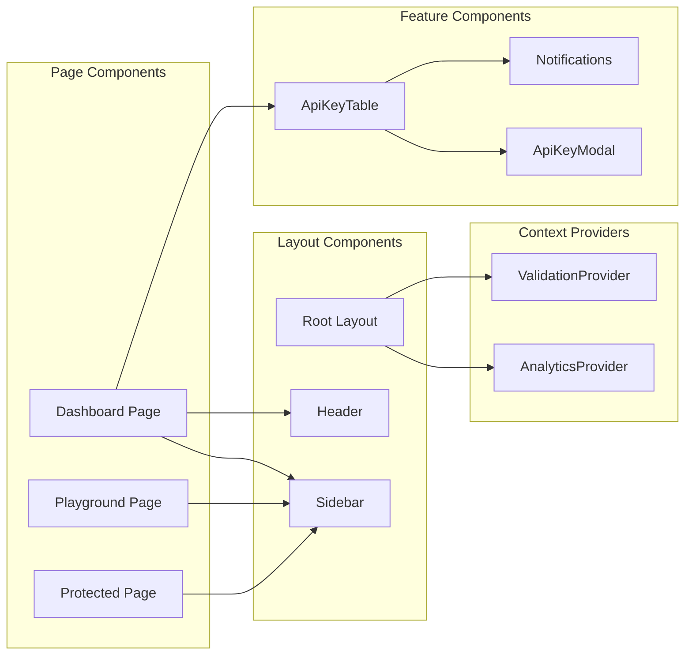

<details>
<summary>📋 Component Hierarchy (Click to expand)</summary>

**Page Level:**
- Dashboard Page (main functionality)
- Playground Page (API testing)
- Protected Page (access control demo)

**Layout Level:**
- Root Layout (provides context)
- Sidebar (navigation)
- Header (analytics cards + actions)

**Feature Level:**
- ApiKeyTable (main data display)
- ApiKeyModal (create/edit forms)
- Notifications (user feedback)

</details>

#### 3. **Service-Oriented Design**
Services encapsulate business logic and data operations:

- **apiKeyService**: CRUD operations for API keys
- **analyticsService**: Metrics calculation and reporting
- **Supabase integration**: Database operations and authentication

### Data Flow Architecture

**User Action Flow:**
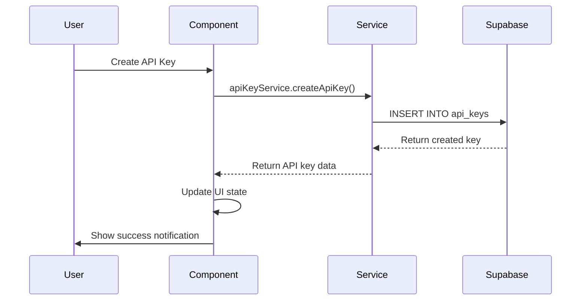

<details>
<summary>📋 Data Flow Steps (Click to expand)</summary>

1. **User Interaction**: User clicks "Generate API Key"
2. **Component Handling**: Dashboard component calls service
3. **Service Processing**: apiKeyService validates and processes
4. **Database Operation**: Supabase inserts new record
5. **Response Handling**: Success data flows back to UI
6. **State Update**: Component updates local state
7. **User Feedback**: Success notification displayed

</details>

### Technology Stack Analysis

| Layer | Technology | Version | Purpose | Strengths |
|-------|------------|---------|---------|-----------|
| **Frontend** | Next.js | 15.3.2 | React Framework | SSR, App Router, Performance |
| **UI Library** | React | 19.0.0 | Component Library | Latest features, Concurrent rendering |
| **Language** | TypeScript | 5+ | Type Safety | Enhanced DX, Runtime safety |
| **Styling** | Tailwind CSS | 4.0 | Utility-first CSS | Rapid development, Consistency |
| **Icons** | React Icons | 5.5.0 | Icon Library | Comprehensive, Tree-shakeable |
| **Backend** | Supabase | 2.49.4 | BaaS Platform | Real-time, Auth, PostgreSQL |
| **Database** | PostgreSQL | Latest | Relational DB | ACID compliance, Scalability |
| **Build Tool** | Turbopack | Latest | Fast bundler | Incremental compilation |

---

## Software Developer Analysis

### Code Quality Assessment

#### **Strengths:**
1. **Type Safety**: Comprehensive TypeScript implementation
2. **Component Modularity**: Well-separated concerns
3. **Service Layer**: Clean abstraction of business logic
4. **Error Handling**: Proper try-catch blocks and user feedback
5. **Responsive Design**: Mobile-first approach

#### **Code Organization:**
```
src/
├── app/                 # Next.js App Router pages
│   ├── dashboard/       # Main dashboard functionality
│   ├── playground/      # API testing interface
│   ├── protected/       # Access-controlled content
│   └── layout.tsx       # Root layout with providers
├── components/          # Reusable UI components
│   ├── dashboard/       # Dashboard-specific components
│   └── access/          # Access control components
├── context/             # React Context providers
├── services/            # Business logic services
├── lib/                 # External service configurations
├── types/               # TypeScript type definitions
└── utils/               # Utility functions
```

### Development Patterns

#### 1. **React Patterns**
```typescript
// Custom Hook Pattern
export function useAnalytics() {
  const context = useContext(AnalyticsContext);
  if (context === undefined) {
    throw new Error('useAnalytics must be used within an AnalyticsProvider');
  }
  return context;
}

// Service Pattern
export const apiKeyService = {
  async getAllApiKeys(): Promise<ApiKey[]> {
    // Implementation with error handling
  },
  async createApiKey(apiKey: Omit<ApiKey, 'id'>): Promise<ApiKey> {
    // Implementation with validation
  }
};
```

#### 2. **State Management**

**State Management Architecture:**
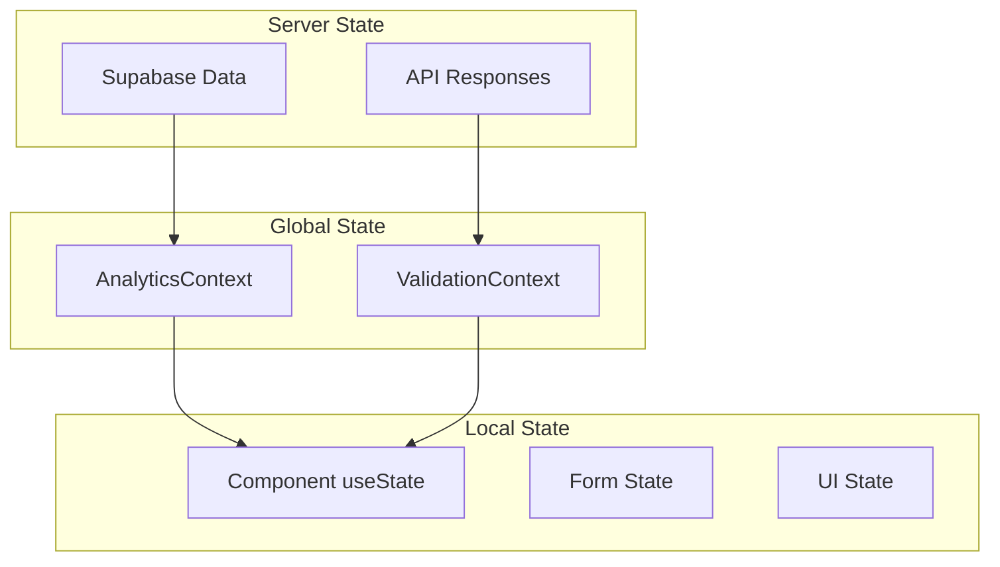

<details>
<summary>📋 State Management Strategy (Click to expand)</summary>

**Global State (React Context):**
- AnalyticsContext: Dashboard metrics and analytics data
- ValidationContext: API key validation state

**Local State (useState):**
- Component-specific UI state (modals, forms)
- Loading and error states
- User interaction states

**Server State:**
- Supabase real-time data
- API responses and cached data

</details>

#### 3. **Error Handling Strategy**
```typescript
// Service Level Error Handling
try {
  const keys = await apiKeyService.getAllApiKeys();
  setApiKeys(keys);
} catch (err) {
  console.error("Failed to fetch API keys:", err);
  setError("Failed to load API keys. Please try again.");
  
  // Graceful fallback to sample data
  setTimeout(() => {
    setApiKeys(initialApiKeys);
    setIsLoading(false);
  }, 800);
}
```

### Performance Optimizations

#### 1. **React Optimizations**
- **useCallback**: Memoized functions for expensive operations
- **Conditional Rendering**: Efficient UI updates
- **Lazy Loading**: Component-level code splitting potential

#### 2. **Database Optimizations**
- **Indexed Queries**: Key column indexing for faster lookups
- **Selective Queries**: Only fetching required columns
- **Connection Pooling**: Supabase handles connection management

#### 3. **Bundle Optimizations**
- **Tree Shaking**: Unused code elimination
- **Turbopack**: Fast incremental builds
- **Dynamic Imports**: Code splitting opportunities

### Testing Strategy Assessment

#### **Current State:**
- **Unit Tests**: Not implemented (opportunity for improvement)
- **Integration Tests**: Not present
- **E2E Tests**: Not configured

#### **Recommended Testing Pyramid:**

**Testing Strategy:**
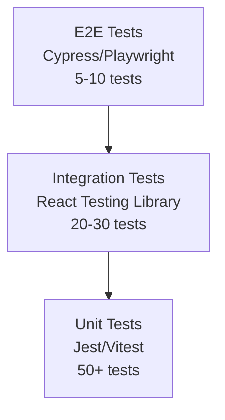

<details>
<summary>📋 Testing Implementation Plan (Click to expand)</summary>

**Unit Tests (Foundation):**
- Service layer functions
- Utility functions
- Component logic
- API key generation/validation

**Integration Tests (Middle):**
- Component interactions
- Context provider functionality
- Service-to-database operations
- User workflows

**E2E Tests (Top):**
- Complete user journeys
- Cross-browser compatibility
- Performance benchmarks
- Security validation

</details>

---

## Product Manager Analysis

### Feature Analysis

#### **Core Features:**
1. **API Key Management** (CRUD operations)
2. **Real-time Analytics Dashboard**
3. **API Key Validation Playground**
4. **Usage Tracking & Limits**
5. **Security Features** (masking, RLS)
6. **Responsive Design** (mobile-first)

#### **User Journey Mapping**

**Customer Journey:**
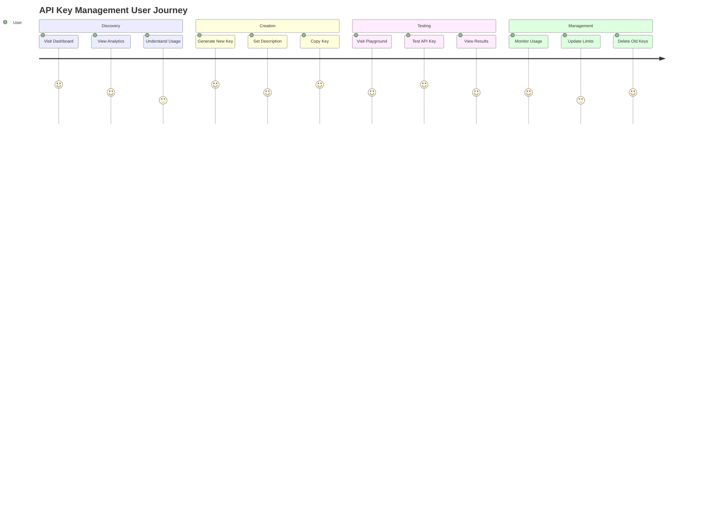

<details>
<summary>📋 User Journey Analysis (Click to expand)</summary>

**Discovery Phase (Learning):**
- Users explore dashboard to understand capabilities
- Analytics provide immediate value and insights
- Clear value proposition becomes apparent

**Creation Phase (Action):**
- Streamlined key generation process
- Descriptive naming for organization
- Easy copy-to-clipboard functionality

**Testing Phase (Validation):**
- Playground provides safe testing environment
- Real-time feedback on key validity
- Usage tracking demonstrates value

**Management Phase (Ongoing):**
- Regular monitoring of key performance
- Proactive limit management
- Lifecycle management (create/update/delete)

</details>

### Market Positioning

#### **Target Audience:**
1. **Primary**: Individual developers and small teams
2. **Secondary**: Medium-sized development teams
3. **Tertiary**: Enterprise developers (with additional features)

#### **Competitive Analysis:**
| Feature | API-Master | Postman | Insomnia | Custom Solution |
|---------|------------|---------|----------|-----------------|
| **Ease of Setup** | ⭐⭐⭐⭐⭐ | ⭐⭐⭐ | ⭐⭐⭐ | ⭐⭐ |
| **Cost** | Free/Low | Freemium | Freemium | High |
| **Customization** | ⭐⭐⭐⭐ | ⭐⭐ | ⭐⭐ | ⭐⭐⭐⭐⭐ |
| **Analytics** | ⭐⭐⭐⭐ | ⭐⭐⭐ | ⭐⭐ | ⭐⭐⭐ |
| **Security** | ⭐⭐⭐⭐ | ⭐⭐⭐⭐⭐ | ⭐⭐⭐⭐ | ⭐⭐⭐ |

### Business Value Proposition

#### **Value Drivers:**
1. **Time to Market**: Rapid deployment and setup
2. **Cost Efficiency**: Open-source with minimal infrastructure costs
3. **Developer Experience**: Intuitive interface and comprehensive features
4. **Security**: Built-in security best practices
5. **Scalability**: Cloud-native architecture

#### **Revenue Model Opportunities:**

**Business Model:**
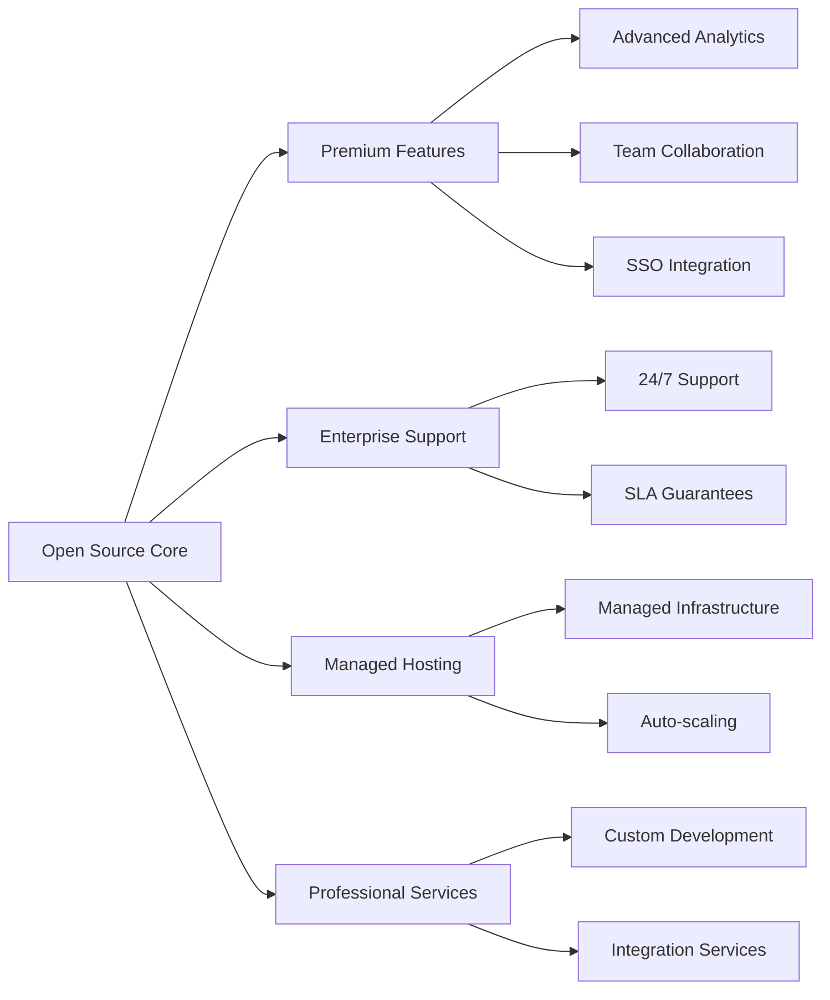

<details>
<summary>📋 Monetization Strategy (Click to expand)</summary>

**Open Source Core:**
- Basic API key management
- Standard analytics
- Community support

**Premium Features ($19-49/month):**
- Advanced analytics and reporting
- Team collaboration tools
- Enhanced security features
- Priority support

**Enterprise Support ($199-499/month):**
- 24/7 technical support
- SLA guarantees
- Custom integrations
- On-premises deployment

**Managed Hosting ($99-299/month):**
- Fully managed infrastructure
- Auto-scaling capabilities
- Backup and disaster recovery
- Performance monitoring

</details>

### Feature Roadmap Analysis

#### **Current MVP Features (✅ Implemented):**
- ✅ API Key CRUD operations
- ✅ Usage tracking and limits
- ✅ Real-time analytics
- ✅ API validation playground
- ✅ Responsive design
- ✅ Security features (masking, RLS)

#### **Immediate Enhancements (🔄 Next Sprint):**
- 🔄 User authentication system
- 🔄 API key expiration management
- 🔄 Export/import functionality
- 🔄 Advanced filtering and search

#### **Medium-term Features (📋 Backlog):**
- 📋 Team collaboration features
- 📋 Webhook notifications
- 📋 Rate limiting controls
- 📋 API documentation generator
- 📋 Integration with popular APIs

#### **Long-term Vision (🚀 Future):**
- 🚀 Enterprise SSO integration
- 🚀 Advanced analytics and reporting
- 🚀 Multi-tenant architecture
- 🚀 API marketplace integration
- 🚀 Machine learning insights

---

## Technical Deep Dive

### Database Schema Analysis

**Database Schema:**
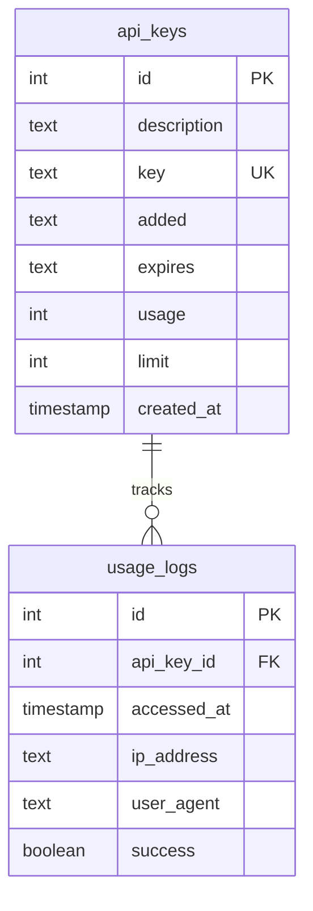

<details>
<summary>📋 Schema Design Details (Click to expand)</summary>

**Current api_keys table:**
- `id`: Primary key (auto-increment)
- `description`: User-friendly label
- `key`: Unique API key with MSTR- prefix
- `added`/`expires`: Text-based dates for display
- `usage`/`limit`: Current usage vs. maximum allowed
- `created_at`: System timestamp

**Proposed usage_logs table:**
- Detailed access tracking
- IP address and user agent logging
- Success/failure tracking
- Response time metrics

</details>

#### **Current Schema Strengths:**
1. **Simplicity**: Easy to understand and maintain
2. **Indexing**: Optimized for key lookups
3. **Security**: RLS policies implemented
4. **Flexibility**: Text-based date fields for display

#### **Schema Optimization Opportunities:**
```sql
-- Recommended improvements
ALTER TABLE api_keys 
ADD COLUMN last_used_at TIMESTAMP,
ADD COLUMN created_by UUID REFERENCES auth.users(id),
ADD COLUMN is_active BOOLEAN DEFAULT true,
ADD COLUMN rate_limit_per_hour INTEGER DEFAULT 1000;

-- Add usage tracking table
CREATE TABLE api_key_usage_logs (
    id SERIAL PRIMARY KEY,
    api_key_id INTEGER REFERENCES api_keys(id),
    accessed_at TIMESTAMP DEFAULT now(),
    ip_address INET,
    success BOOLEAN DEFAULT true,
    response_time_ms INTEGER
);
```

### API Design Patterns

#### **RESTful Service Layer:**
```typescript
interface ApiKeyService {
  // CRUD Operations
  getAllApiKeys(): Promise<ApiKey[]>
  getApiKeyById(id: number): Promise<ApiKey | null>
  createApiKey(apiKey: Omit<ApiKey, 'id'>): Promise<ApiKey>
  updateApiKey(id: number, updates: Partial<ApiKey>): Promise<void>
  deleteApiKey(id: number): Promise<void>
  
  // Business Logic
  incrementUsage(id: number): Promise<number>
  generateApiKeyString(): string
}
```

#### **Analytics Service Architecture:**

**Analytics Pipeline:**
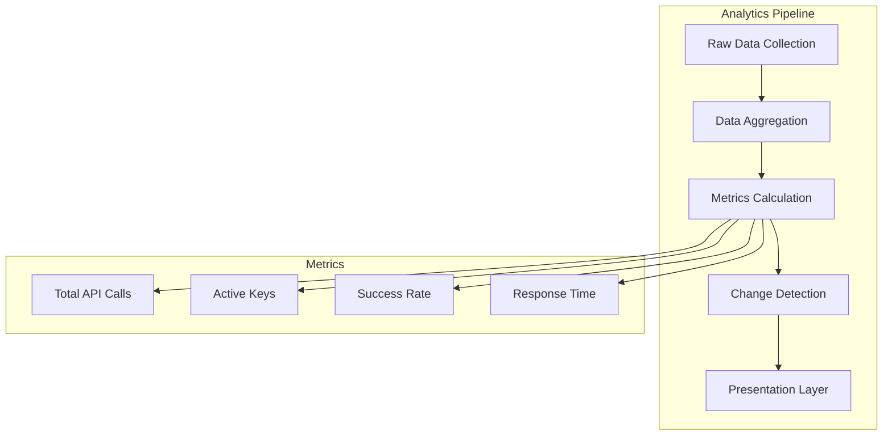

<details>
<summary>📋 Analytics Implementation (Click to expand)</summary>

**Data Collection:**
- API key usage events
- Response times
- Success/failure rates
- User interaction patterns

**Aggregation:**
- Hourly, daily, monthly rollups
- Key performance indicators
- Trend analysis

**Metrics Calculation:**
- Total API calls (sum of usage)
- Active keys (usage > 0)
- Success rate (successful calls / total calls)
- Average response time

**Change Detection:**
- Period-over-period comparisons
- Anomaly detection
- Growth rate calculations

</details>

### Security Implementation

#### **Security Layers:**

**Security Architecture:**
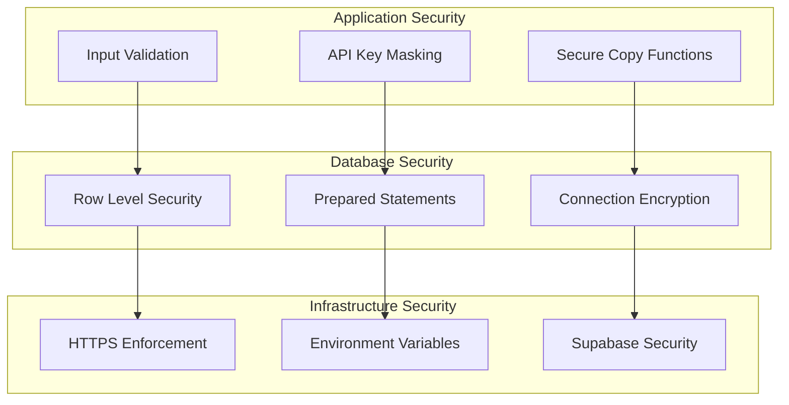

<details>
<summary>📋 Security Implementation Details (Click to expand)</summary>

**Application Level:**
- Input validation and sanitization
- API key masking in UI
- Secure clipboard operations
- Client-side error handling

**Database Level:**
- Row-Level Security policies
- Parameterized queries
- Encrypted connections
- Access logging

**Infrastructure Level:**
- HTTPS/TLS encryption
- Environment variable protection
- Supabase managed security
- Regular security updates

</details>

#### **RLS Policy Implementation:**
```sql
-- Current RLS policy
CREATE POLICY "Authenticated users can perform all operations" 
  ON api_keys 
  FOR ALL 
  TO authenticated 
  USING (true);

-- Recommended enhanced policies
CREATE POLICY "Users can only access their own keys"
  ON api_keys
  FOR ALL
  TO authenticated
  USING (created_by = auth.uid());
```

---

## Security Assessment

### Current Security Measures

#### **✅ Implemented Security Features:**
1. **API Key Masking**: Client-side key obfuscation
2. **Row-Level Security**: Database-level access control
3. **Environment Variables**: Secure credential storage
4. **HTTPS**: Encrypted data transmission
5. **Input Validation**: Basic form validation

#### **🔒 Security Best Practices:**
```typescript
// Secure API key display
const displayKey = (key: string, id: number) => {
  if (visibleKeyId === id) return key;
  
  if (key.startsWith("MSTR-")) {
    const lastSix = key.slice(-6);
    return `MSTR-${"•".repeat(key.length - 11)}${lastSix}`;
  }
  
  const lastSix = key.slice(-6);
  return `${"•".repeat(key.length - 6)}${lastSix}`;
};
```

### Security Vulnerabilities & Recommendations

#### **🚨 High Priority:**
1. **Authentication Missing**: No user authentication system
2. **API Key Storage**: Keys stored in plain text
3. **Rate Limiting**: No request throttling
4. **Audit Logging**: Limited access tracking

#### **⚠️ Medium Priority:**
1. **CSRF Protection**: No CSRF tokens
2. **XSS Prevention**: Basic but could be enhanced
3. **Session Management**: No session timeout
4. **IP Whitelisting**: Not implemented

#### **📋 Recommended Security Enhancements:**
```typescript
// Enhanced security service
export const securityService = {
  // Hash API keys before storage
  async hashApiKey(key: string): Promise<string> {
    return await bcrypt.hash(key, 12);
  },
  
  // Validate API key with rate limiting
  async validateWithRateLimit(key: string, ip: string): Promise<boolean> {
    // Implementation with Redis/memory cache
  },
  
  // Audit logging
  async logAccess(keyId: number, ip: string, success: boolean): Promise<void> {
    // Implementation with usage_logs table
  }
};
```

---

## Performance Analysis

### Current Performance Characteristics

#### **Frontend Performance:**
- **Bundle Size**: Optimized with Turbopack
- **Rendering**: React 19 concurrent features
- **Responsiveness**: Mobile-first design
- **Loading States**: Implemented for better UX

#### **Backend Performance:**
- **Database Queries**: Indexed for key lookups
- **Connection Pooling**: Managed by Supabase
- **Caching**: Minimal (opportunity for improvement)

### Performance Optimization Opportunities

#### **Frontend Optimizations:**

**Performance Optimization Path:**
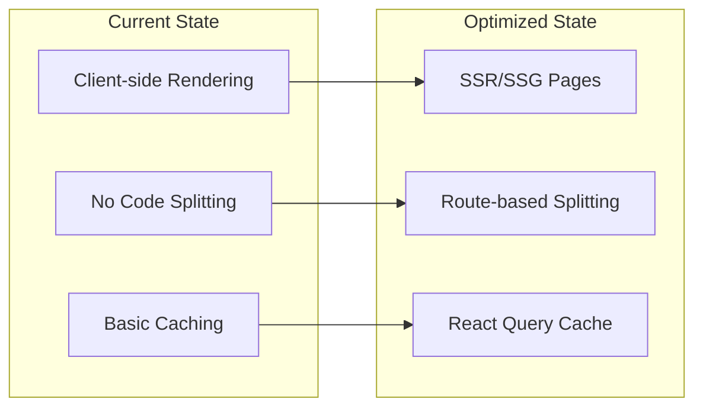

<details>
<summary>📋 Performance Optimization Strategy (Click to expand)</summary>

**Current Limitations:**
- Full client-side rendering
- No route-based code splitting
- Limited caching mechanisms
- No performance monitoring

**Optimization Targets:**
- Server-side rendering for faster initial load
- Dynamic imports for code splitting
- React Query for server state caching
- Performance monitoring and analytics

</details>

#### **Backend Optimizations:**
```typescript
// Recommended caching strategy
export const cacheService = {
  // Cache analytics data
  async getCachedAnalytics(): Promise<AnalyticsData> {
    const cached = await redis.get('analytics:current');
    if (cached) return JSON.parse(cached);
    
    const fresh = await analyticsService.getAnalyticsData();
    await redis.setex('analytics:current', 300, JSON.stringify(fresh));
    return fresh;
  }
};
```

### Scalability Metrics

#### **Current Capacity:**
- **Concurrent Users**: ~100-500 (estimated)
- **API Keys**: Unlimited (database constraint)
- **Requests/Second**: ~50-100 (Supabase limit)

#### **Scaling Strategy:**

**Scaling Architecture:**
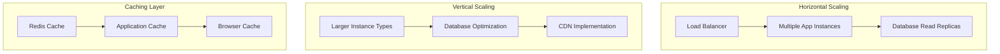

<details>
<summary>📋 Scaling Implementation Plan (Click to expand)</summary>

**Horizontal Scaling:**
- Load balancer for traffic distribution
- Multiple application instances
- Database read replicas for query performance

**Vertical Scaling:**
- Larger compute instances
- Database performance tuning
- CDN for static asset delivery

**Caching Strategy:**
- Redis for session and data caching
- Application-level caching
- Browser caching for static resources

</details>

---

## Scalability Considerations

### Current Architecture Limitations

#### **Single-Tenant Design:**
- All users share the same database
- No data isolation between organizations
- Limited customization per user/org

#### **Stateful Components:**
- Client-side state management
- No distributed session handling
- Limited real-time capabilities

### Multi-Tenant Architecture Proposal

**Multi-Tenant Design:**
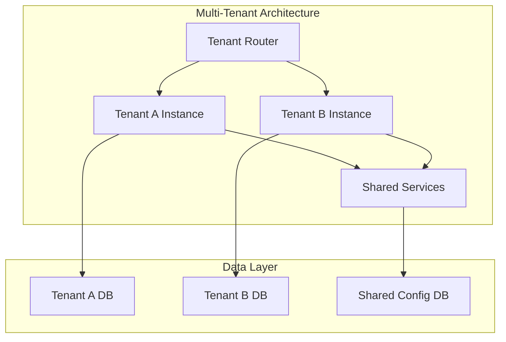

<details>
<summary>📋 Multi-Tenant Implementation (Click to expand)</summary>

**Tenant Isolation:**
- Separate database schemas per tenant
- Isolated application instances
- Shared configuration and routing

**Benefits:**
- Data isolation and security
- Custom feature sets per tenant
- Independent scaling
- Regulatory compliance

**Implementation Approach:**
- Database-per-tenant model
- Tenant-aware routing
- Shared infrastructure services

</details>

### Microservices Migration Path

#### **Phase 1: Service Extraction**
```typescript
// Extract core services
interface ApiKeyMicroservice {
  createKey(tenantId: string, keyData: CreateKeyRequest): Promise<ApiKey>
  validateKey(key: string): Promise<ValidationResult>
  trackUsage(keyId: string, metadata: UsageMetadata): Promise<void>
}

interface AnalyticsMicroservice {
  getMetrics(tenantId: string, timeRange: TimeRange): Promise<Metrics>
  generateReport(tenantId: string, config: ReportConfig): Promise<Report>
}
```

#### **Phase 2: Event-Driven Architecture**

**Microservices Communication:**
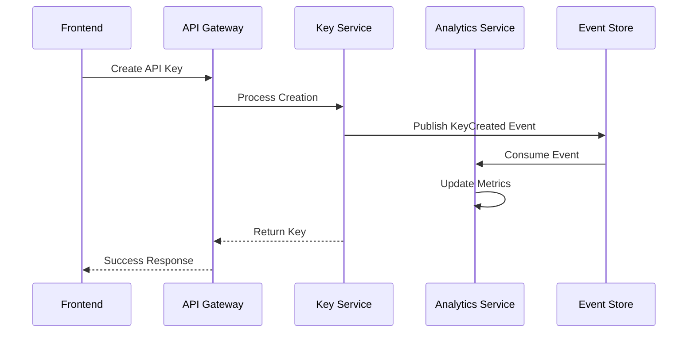

<details>
<summary>📋 Microservices Migration Strategy (Click to expand)</summary>

**Phase 1: Service Extraction**
- Extract API key management service
- Create analytics microservice
- Implement service communication

**Phase 2: Event-Driven Architecture**
- Event store for service communication
- Asynchronous processing
- Improved scalability and resilience

**Benefits:**
- Independent service scaling
- Technology diversity
- Fault isolation
- Development team autonomy

</details>

---

## Recommendations

### Immediate Actions (Next 2 Weeks)

#### **🔥 Critical:**
1. **Implement Authentication**
   ```typescript
   // Add Supabase Auth
   import { useUser } from '@supabase/auth-helpers-react'
   
   export function ProtectedRoute({ children }: { children: ReactNode }) {
     const { user, loading } = useUser()
     
     if (loading) return <LoadingSpinner />
     if (!user) return <LoginForm />
     
     return <>{children}</>
   }
   ```

2. **Add Unit Tests**
   ```typescript
   // Example test structure
   describe('apiKeyService', () => {
     it('should create API key with MSTR prefix', async () => {
       const key = apiKeyService.generateApiKeyString()
       expect(key).toMatch(/^MSTR-[a-f0-9-]{36}$/)
     })
   })
   ```

3. **Environment Configuration**
   ```bash
   # Required environment variables
   NEXT_PUBLIC_SUPABASE_URL=your_supabase_url
   NEXT_PUBLIC_SUPABASE_ANON_KEY=your_anon_key
   SUPABASE_SERVICE_ROLE_KEY=your_service_role_key
   ```

### Short-term Improvements (Next Month)

#### **🚀 High Impact:**
1. **Enhanced Security**
   - API key encryption at rest
   - Rate limiting implementation
   - Audit logging system
   - CSRF protection

2. **Performance Optimization**
   - React Query for server state
   - Database query optimization
   - Image optimization
   - Bundle size reduction

3. **User Experience**
   - Advanced filtering and search
   - Bulk operations
   - Export/import functionality
   - Keyboard shortcuts

### Long-term Vision (Next Quarter)

#### **🎯 Strategic Goals:**
1. **Enterprise Features**
   - Multi-tenant architecture
   - SSO integration
   - Advanced analytics
   - Team collaboration

2. **Platform Expansion**
   - API marketplace integration
   - Third-party integrations
   - Mobile application
   - Desktop application

3. **Business Model**
   - Premium feature tiers
   - Managed hosting service
   - Professional support
   - Enterprise consulting

### Technical Debt Assessment

#### **🔧 Refactoring Priorities:**

**Technical Debt Priority Matrix:**
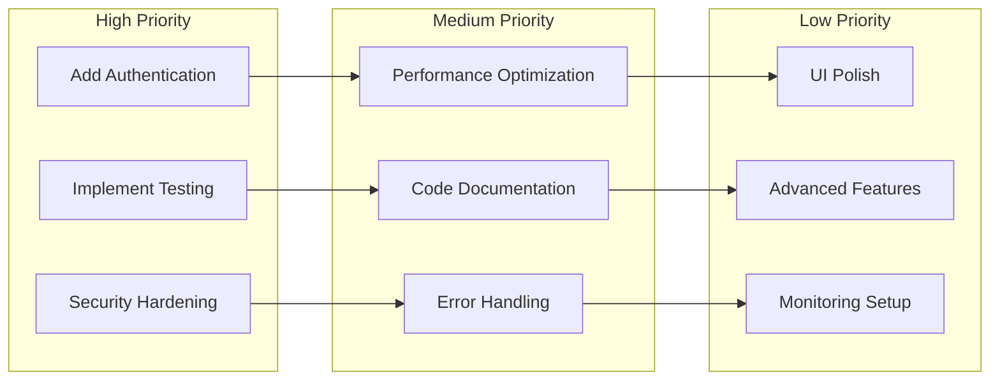

<details>
<summary>📋 Technical Debt Action Plan (Click to expand)</summary>

**High Priority (Immediate):**
- Authentication system implementation
- Comprehensive testing suite
- Security vulnerability fixes

**Medium Priority (1-2 months):**
- Performance optimization
- Documentation improvements
- Enhanced error handling

**Low Priority (3+ months):**
- UI/UX polish
- Advanced feature development
- Monitoring and observability

</details>

---

## Conclusion

API-Master represents a well-architected, modern web application that successfully demonstrates best practices in React, TypeScript, and cloud-native development. The codebase shows strong architectural decisions, clean code organization, and a clear separation of concerns.

### **Key Strengths:**
- ✅ Modern technology stack with latest versions
- ✅ Clean, maintainable code architecture
- ✅ Responsive, user-friendly interface
- ✅ Solid foundation for scaling
- ✅ Good security practices (with room for improvement)

### **Primary Opportunities:**
- 🔄 Authentication and authorization system
- 🔄 Comprehensive testing strategy
- 🔄 Enhanced security measures
- 🔄 Performance optimizations
- 🔄 Multi-tenant capabilities

### **Business Potential:**
The application has strong potential for commercialization with its solid technical foundation, clear value proposition, and growing market demand for API management solutions. With the recommended enhancements, it could compete effectively in the API management space.

### **Development Readiness:**
The codebase is production-ready for small to medium-scale deployments and provides an excellent foundation for enterprise-level features. The modular architecture and clean separation of concerns make it highly maintainable and extensible.

---

## How to View Mermaid Diagrams

If you cannot see the Mermaid diagrams in your current viewer, try one of these options:

1. **GitHub**: Upload this file to GitHub - native Mermaid support
2. **VS Code**: Install the "Mermaid Preview" extension
3. **Online**: Copy the file to [Mermaid Live Editor](https://mermaid.live/)
4. **Typora**: Supports Mermaid out of the box
5. **Obsidian**: Native Mermaid support

Each diagram also includes a text-based description in expandable sections for accessibility.

---

*This analysis was generated on January 17, 2025, based on the current state of the API-Master codebase. For questions or clarifications, please refer to the individual sections above or consult the technical documentation.* 