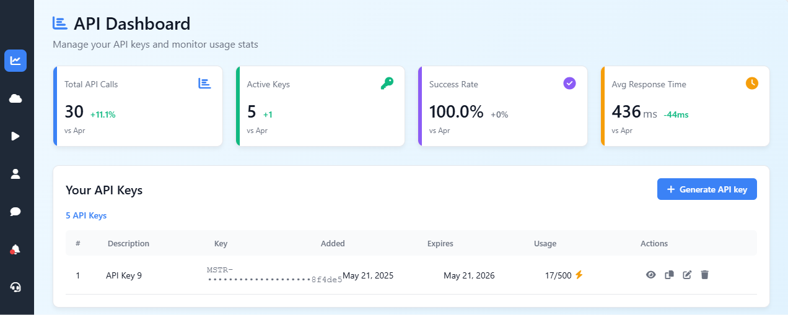

# API-Master: Modern API Key Management Dashboard



API-Master is a modern, responsive web application for managing API keys with comprehensive tracking and security features. Built with Next.js, TypeScript, and Supabase, it provides a streamlined interface for creating, monitoring, and managing API keys across your organization or personal projects.

## Table of Contents

- [Features](#features)
- [Technology Stack](#technology-stack)
- [Architecture](#architecture)
- [Pages](#pages)
  - [Dashboard](#dashboard)
  - [API Playground](#api-playground)
  - [Protected Page](#protected-page)
- [Getting Started](#getting-started)
  - [Prerequisites](#prerequisites)
  - [Installation](#installation)
  - [Environment Setup](#environment-setup)
- [Database Schema](#database-schema)
- [Key Components](#key-components)
- [API Key Management](#api-key-management)
- [Analytics System](#analytics-system)
- [Responsive Design](#responsive-design)
- [Security Features](#security-features)
- [Deployment](#deployment)
- [Future Enhancements](#future-enhancements)
- [Contributing](#contributing)
- [License](#license)

## Features

- **Complete API Key Lifecycle Management**
  - Create API keys with unique MSTR- prefix
  - Read and display keys with secure masking
  - Update key descriptions and metadata
  - Delete keys with proper validation
  
- **Interactive API Playground**
  - Test and validate API keys
  - Track usage in real-time
  - Secure access to protected resources
  
- **Real-time Analytics Dashboard**
  - Track API key usage against limits
  - View key performance metrics
  - Compare current vs. previous period stats
  
- **Security & Access Control**
  - Masked API keys with toggle visibility
  - One-click copy to clipboard functionality
  - Row-Level Security (RLS) integration with Supabase
  - Protected routes with key validation
  
- **Modern Responsive UI**
  - Fully responsive layout for mobile, tablet, and desktop
  - Interactive and animated notifications
  - Touch-optimized for mobile devices
  - Collapsible sidebar navigation

## Technology Stack

- **Frontend**
  - [Next.js](https://nextjs.org/) (v15.3.2): React framework for server-rendered applications
  - [React](https://reactjs.org/) (v19.0.0): UI component library
  - [TypeScript](https://www.typescriptlang.org/) (v5+): Typed JavaScript for enhanced code quality
  - [Tailwind CSS](https://tailwindcss.com/) (v4): Utility-first CSS framework for styling
  - [React Icons](https://react-icons.github.io/react-icons/) (v5.5.0): Icon component library

- **Backend & Data Storage**
  - [Supabase](https://supabase.com/): Open-source Firebase alternative for:
    - PostgreSQL database
    - Authentication
    - Row-Level Security policies
    - RESTful API endpoints

- **Development Tools**
  - [ESLint](https://eslint.org/) (v9): Code quality and style checking
  - [Turbopack](https://turbo.build/pack): Fast incremental bundler (Next.js integration)

## Architecture

API-Master follows a modern client-side application architecture with service-layer abstractions for backend operations:

1. **Client Layer**: Next.js pages and React components
   - Responsive UI components
   - Client-side state management via React Context
   - Form handling and validation
   
2. **Service Layer**: TypeScript services for data operations
   - API key service for CRUD operations
   - Analytics service for metrics
   - Encapsulated Supabase client interactions
   
3. **Data Layer**: Supabase PostgreSQL database
   - Structured schema with relations
   - Row-Level Security policies
   - RESTful API endpoints


## Pages

### Dashboard

The main dashboard provides a comprehensive view of all API keys and analytics:

- Real-time analytics cards showing key metrics
- Table of API keys with icon-based actions
- Create, view, edit, and delete API keys
- Progress bars for usage tracking

### API Playground

The API Playground allows users to test and validate API keys:

- Input field for API key validation
- Real-time validation feedback
- Usage tracking integration
- Educational content about API security

### Protected Page

A demonstration of key-based access control:

- Access only granted with valid API key
- Session-based validation
- Security best practices showcase
- API key usage indicators

## Getting Started

### Prerequisites

- Node.js 18.0 or later
- npm or yarn package manager
- Supabase account (free tier available)

### Installation

```bash
# Clone the repository
git clone https://github.com/yourusername/api-master.git
cd api-master

# Install dependencies
npm install
# or
yarn install
```

### Environment Setup

1. Create a `.env.local` file in the project root with your Supabase credentials:

```
NEXT_PUBLIC_SUPABASE_URL=https://your-project-url.supabase.co
NEXT_PUBLIC_SUPABASE_ANON_KEY=your-anon-key
```

2. Set up the database schema by running the SQL script in Supabase:
   - Navigate to Supabase SQL Editor
   - Execute the contents of `scripts/supabase_schema.sql`

3. Start the development server:

```bash
npm run dev
# or
yarn dev
```

Your application should now be running at [http://localhost:3000](http://localhost:3000).

## Database Schema

The API-Master application uses a PostgreSQL database with the following schema:

### api_keys Table

| Column | Type | Description |
|--------|------|-------------|
| id | SERIAL PRIMARY KEY | Unique identifier for each API key |
| description | TEXT | Description of the API key's purpose |
| key | TEXT | The actual API key value (prefixed with MSTR-) |
| added | TEXT | Date when the key was added |
| expires | TEXT | Expiration date for the key |
| usage | INTEGER | Current usage count |
| limit | INTEGER | Maximum allowed usage |
| created_at | TIMESTAMP WITH TIME ZONE | Auto-generated creation timestamp |

### Row-Level Security

The database uses Row-Level Security policies to restrict access to records:

```sql
-- Enable RLS on the table
ALTER TABLE api_keys ENABLE ROW LEVEL SECURITY;

-- Create a policy that allows authenticated users to perform all operations
CREATE POLICY "Authenticated users can perform all operations" 
  ON api_keys 
  FOR ALL 
  TO authenticated 
  USING (true);
```

## Key Components

### Dashboard Layout

The main dashboard (`/src/app/dashboard/page.tsx`) provides a comprehensive view of all API keys with:

- Responsive sidebar navigation
- API key creation functionality
- Table/card view of existing keys
- Usage statistics and limits

### Analytics System

The application includes a robust analytics system:

- `AnalyticsContext` provides app-wide analytics state
- `analyticsService` fetches and calculates metrics
- Real-time dashboard cards with change indicators
- Period-over-period comparisons

### API Key Service

The API key service (`/src/services/apiKeyService.ts`) encapsulates all API key operations:

- `getAllApiKeys()`: Fetches all keys
- `getApiKeyById(id)`: Retrieves a specific key
- `createApiKey(apiKey)`: Creates a new key
- `updateApiKey(id, updates)`: Updates key properties
- `deleteApiKey(id)`: Removes a key
- `incrementUsage(id)`: Tracks key usage
- `generateApiKeyString()`: Creates new API keys with MSTR- prefix

## API Key Management

### Key Generation

API keys are generated with a unique format:

```typescript
// Generate a new API key with MSTR prefix
const uuid = 'xxxxxxxx-xxxx-4xxx-yxxx-xxxxxxxxxxxx'.replace(/[xy]/g, function(c) {
  const r = Math.random() * 16 | 0;
  const v = c === 'x' ? r : (r & 0x3 | 0x8);
  return v.toString(16);
});

// Add the MSTR prefix
return `MSTR-${uuid}`;
```

### Key Display and Security

API keys are masked by default, with options to view the full key:

```typescript
// Display key securely with masking
const displayKey = (key: string, id: number) => {
  if (visibleKeyId === id) {
    return key;
  }
  // If the key is already masked with dots, return as is
  if (key.startsWith("•")) {
    return key;
  }
  // Mask the key, showing the MSTR- prefix and the last 6 characters
  if (key.startsWith("MSTR-")) {
    const lastSix = key.slice(-6);
    return `MSTR-${"•".repeat(key.length - 11)}${lastSix}`;
  } else {
    // For keys without the MSTR- prefix, still show last 6 characters
    const lastSix = key.slice(-6);
    return `${"•".repeat(key.length - 6)}${lastSix}`;
  }
};
```

## Analytics System

The analytics system provides real-time metrics about API key usage:

### Key Metrics

- **Total API Calls**: Sum of all API key usages
- **Active Keys**: Count of keys with non-zero usage
- **Success Rate**: Percentage of successful API calls
- **Average Response Time**: Performance metric for API calls

### Implementation

The analytics service calculates metrics from API key data:

```typescript
// Calculate total API calls (sum of all usage)
const totalApiCalls = apiKeys.reduce((sum, key) => sum + key.usage, 0);

// Calculate active keys (keys with usage > 0)
const activeKeys = apiKeys.filter(key => key.usage > 0).length;

// Calculate success rate
const usedKeys = apiKeys.filter(key => key.usage > 0);
const successfulKeys = usedKeys.filter(key => key.usage < key.limit);
const successRate = usedKeys.length > 0 
  ? (successfulKeys.length / usedKeys.length) * 100 
  : 100;
```

## Responsive Design

API-Master implements a mobile-first responsive design approach using Tailwind CSS:

### Breakpoints

- **Mobile** (< 640px): Stacked layout with card-based UI
- **Tablet** (640px - 1024px): Side-by-side layout with streamlined table
- **Desktop** (> 1024px): Full-featured layout with complete table view

### Mobile Optimizations

- Collapsible sidebar navigation
- Card layout instead of tables for better readability
- Fixed floating action button for key creation
- Touch-optimized button sizes and spacing
- Reduced information density for better usability

### Tablet and Desktop Features

- Side-by-side layout with persistent sidebar
- Full table view with sortable columns
- Advanced filtering and search capabilities
- Keyboard shortcuts and hover states

## Security Features

### API Key Masking

API keys are masked by default with options to temporarily view the full key.

### Copy to Clipboard

Secure one-click copy functionality with visual feedback.

### Row-Level Security (RLS)

Supabase RLS policies ensure that users can only access their own data.

### Key Validation

The API Playground validates keys and increments usage counts before granting access to protected resources.

## Deployment

API-Master can be deployed to various platforms:

### Vercel Deployment

```bash
# Install Vercel CLI
npm install -g vercel

# Deploy
vercel
```

### Docker Deployment

A Dockerfile is provided for containerized deployment:

```bash
# Build the Docker image
docker build -t api-master .

# Run the container
docker run -p 3000:3000 api-master
```

## Future Enhancements

- **Authentication System**: User login, registration, and profile management
- **Team Collaboration**: Shared API keys within organizations
- **Advanced Analytics**: Detailed usage statistics and reporting
- **Webhook Support**: Event notifications for key usage and limits
- **Rate Limiting**: Advanced control over API key usage patterns
- **API Documentation**: Interactive API documentation with examples
- **Integration Testing**: Automated testing for API key validation

## Contributing

We welcome contributions to API-Master! Please see [CONTRIBUTING.md](CONTRIBUTING.md) for guidelines on how to contribute.

## License

This project is licensed under the MIT License - see the [LICENSE](LICENSE) file for details.

---

© 2024 API-Master. All Rights Reserved.
